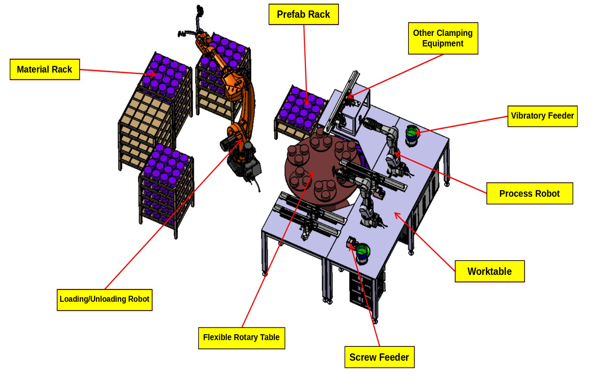
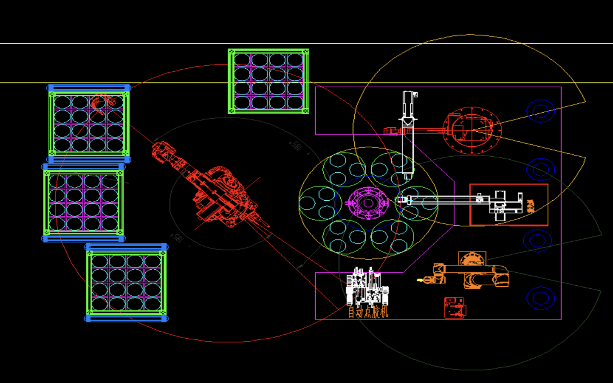
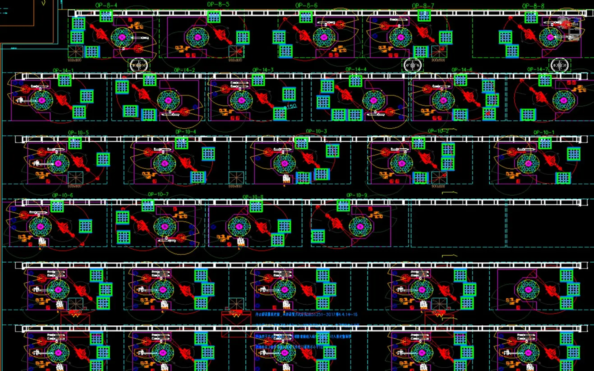
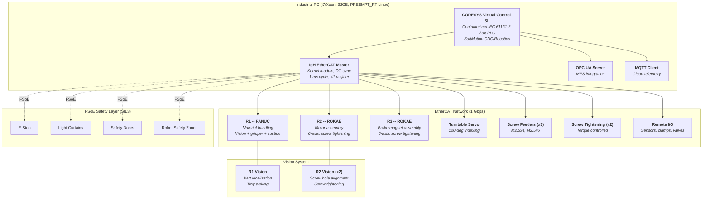

# Multi-Robot Assembly Cell

### 3-Robot EtherCAT Assembly Cell for Harmonic Reducer Production

*Portfolio project reverse-engineering a multi-robot harmonic reducer assembly workstation*
*from CloudMinds Robotics. 3 coordinated robots, 120-degree turntable, 94-second takt time.*

---

[Architecture](#system-architecture) · [Process Flow](#assembly-process) · [Documentation](#documentation) · [Source Code](#source-code) · [Tech Stack](#technology-stack)

 

## Workstation Overview

  

  
  

  <em>Top left: 3D isometric view -- turntable, 3 robots (R1 FANUC, R2/R3 ROKAE), material racks, screw feeders.
  Top right: CAD top-down layout -- R1/R2/R3 positions, 120-degree turntable zones, conveyor interface.
  Bottom: Full production line with multiple OP-8 workstations in harmonic reducer assembly flow.</em>

---

## Overview

This project reverse-engineers the complete automation system for an **OP08#-1 harmonic reducer actuator motor assembly workstation** originally deployed at CloudMinds Robotics. The workstation uses three coordinated robots around a 120-degree indexed turntable to assemble motor mount bodies, non-crystal motors, and brake magnet bases into harmonic reducer actuators at a 94-second takt time.

The forward-looking architecture replaces the original Siemens SICAR stack with an open, Linux-based control platform built on **CODESYS Virtual Control SL** (containerized soft PLC) and **IgH EtherCAT Master** (kernel-space, PREEMPT_RT).

<table>
<tr><td>

**What it does**

- Assembles harmonic reducer actuator motors (Actuator #8 and #11&#18 variants)
- Coordinates 3 robots (1 FANUC + 2 ROKAE) around a 120-degree indexed turntable
- Handles motor mount body loading, motor placement, screw tightening, and brake magnet assembly
- Supports product variant switching between Actuator #8 (4-screw motor only) and #11&#18 (+ 2-screw brake magnet)
- Integrates vision-guided picking, screw feeding, and torque-controlled tightening

</td><td>

**How it works**

- R1 (FANUC) handles material: picks from trays via vision, loads/unloads turntable station 1
- Turntable rotates 120 degrees to advance workpieces through 3 zones
- R2 (ROKAE) performs motor assembly: placement, alignment, 4x M2.5x4 screw tightening
- R3 (ROKAE) performs brake magnet assembly (Actuator #11&#18 only): 2x M2.5x6 screws
- EtherCAT fieldbus synchronizes all axes at 1 ms cycle time

</td></tr>
</table>

### Key Specifications

| | |
|---|---|
| **Product** | Harmonic reducer actuator motor assembly -- Actuator #8 (L120 x W86.8 x H33.75 mm) and Actuator #11&#18 (L155 x W80 x H53.6 mm) |
| **Motors** | 40mm non-crystal motor (D47 x H17 mm) for #8, 60mm non-crystal motor (D68 x H20.8 mm) for #11&#18 |
| **Turntable** | 1-1.3m diameter flexible mother plate, 6 index plates x 3 sub-plates = 18 tooling positions, 120-degree indexing |
| **Takt Time** | 94 seconds (bottleneck: R2 assembly zone) -- Zone 1: 50s, Zone 2: 94s, Zone 3: 88s |
| **Robots** | 1x FANUC (material handling) + 2x ROKAE 6-axis (assembly process) |
| **Screws** | M2.5x4 hex socket CSK (x4, motor mount) + M2.5x6 hex socket CSK (x2, brake magnet) |
| **Control** | CODESYS Virtual Control SL on IPC (i7/Xeon, 32GB, PREEMPT_RT Linux) |
| **Fieldbus** | EtherCAT 1 Gbps, 1 ms cycle, IgH kernel-space master |
| **Safety** | FSoE (Fail Safe over EtherCAT) SIL3, ISO 13849-1 PLd, ISO 10218 robot safety zones |
| **Connectivity** | OPC UA for MES integration, MQTT for cloud telemetry |

---

## System Architecture

---

## Assembly Process

The OP08#-1 workstation executes a 17-step assembly sequence across 3 turntable zones. Steps 12-16 are only executed for Actuator #11&#18 (with brake magnet base).

```mermaid
flowchart TD
    subgraph ZONE1["Zone 1 -- R1 Material Handling (50s)"]
        S1["1. R1 picks finished product<br/>from station 1 -> conveyor"]
        S2["2. R1 vision picks motor mount body<br/>from tray -> station 1"]
        S3["3. R1 vision picks motor<br/>from tray -> turntable transit"]
        S4["4. R1 vision picks brake magnet base<br/>(#11&#18 only) -> turntable transit"]
    end

    subgraph ROT1["Turntable Rotation 120 deg"]
        TR1["Turntable indexes 120 deg"]
    end

    subgraph ZONE2["Zone 2 -- R2 Motor Assembly (94s)"]
        S5["5. R2 picks motor<br/>from turntable -> worktable"]
        S6["6. Wire harness dressing"]
        S7["7. R2 picks motor mount body<br/>from turntable -> worktable<br/>(descend to align)"]
        S8["8. Clamp press motor / mount body"]
        S9["9. R2 picks screws from feeder<br/>M2.5x4 x4"]
        S10["10. R2 auto-tighten screws"]
        S11["11. Release clamp"]
    end

    subgraph ROT2["Turntable Rotation 120 deg"]
        TR2["Turntable indexes 120 deg"]
    end

    subgraph ZONE3["Zone 3 -- R3 Brake Magnet Assembly (88s)"]
        S12["12. R3 picks brake magnet base<br/>(#11&#18 only) -> worktable"]
        S13["13. Clamp press"]
        S14["14. R3 picks screws from feeder<br/>M2.5x6 x2"]
        S15["15. R3 auto-tighten screws"]
        S16["16. Release clamp"]
        S17["17. R2 picks finished assembly<br/>-> turntable station 3"]
    end

    S1 --> S2 --> S3 --> S4
    S4 --> TR1
    TR1 --> S5 --> S6 --> S7 --> S8 --> S9 --> S10 --> S11
    S11 --> TR2
    TR2 --> S12 --> S13 --> S14 --> S15 --> S16 --> S17
```

---

## Documentation

Detailed technical documentation covering the complete workstation design:

| Document | Topics | Key Content |
|:---------|:-------|:------------|
| **[System Architecture](docs/system-architecture.md)** | IPC, PLC, EtherCAT, vision, networking | CODESYS Virtual Control SL containerized runtime, IgH EtherCAT Master (PREEMPT_RT), DC synchronization, EtherCAT network topology, OPC UA / MQTT connectivity, vision system integration |
| **[Process Flow](docs/process-flow.md)** | 17-step assembly sequence, timing | Step-by-step OP08#-1 process, zone-by-zone cycle time analysis (50s / 94s / 88s), product variant switching, turntable indexing logic |
| **[Robot Coordination](docs/robot-coordination.md)** | Multi-robot control, interlocks, takt | 3-zone interlock logic, turntable rotation synchronization, collision avoidance, workspace overlap prevention, variant-based zone skipping |
| **[Safety Design](docs/safety-design.md)** | Functional safety, standards, zones | ISO 13849-1 PLd architecture, FSoE over EtherCAT (SIL3), E-Stop / light curtains / safety doors, ISO 10218 robot safety zones, collaborative workspace monitoring |

---

## Source Code

> **Python 3.10+ / C++ / IEC 61131-3 ST** -- Control software implementing multi-robot coordination, EtherCAT communication, vision-guided assembly, and PLC logic for the OP08#-1 workstation.

| Module | File | Description |
|:-------|:-----|:------------|
| **PLC** | [`main_sequence.st`](src/plc/main_sequence.st) | IEC 61131-3 Structured Text main cyclic program -- 17-step assembly state machine, zone coordination |
| **Robot Control** | [`CellOrchestrator.py`](src/robot_control/CellOrchestrator.py) | Master controller -- cell state machine, zone-based parallel execution, turntable synchronization |
| | [`RobotInterface.py`](src/robot_control/RobotInterface.py) | Unified abstraction for FANUC and ROKAE -- motion, tool control, vision-guided picking, force-controlled placement |
| | [`MaterialHandler.py`](src/robot_control/MaterialHandler.py) | Material flow management -- tray stackers, conveyor belts, C-shape rack, part tracking |
| | [`ScrewTighteningManager.py`](src/robot_control/ScrewTighteningManager.py) | Multi-step screw driving -- M2.5x4 (R2, motor mount) and M2.5x6 (R3, brake magnet), torque/angle monitoring |
| | [`VisionSystem.py`](src/robot_control/VisionSystem.py) | 2D machine vision -- part localization, screw hole detection, tray-slot occupancy, GigE Vision / USB3 |
| **EtherCAT** | [`EthercatMaster.cpp`](src/ethercat/EthercatMaster.cpp) / [`.h`](src/ethercat/EthercatMaster.h) | IgH EtherCAT Master wrapper -- domain configuration, PDO exchange, distributed clock synchronization |
| | [`RobotSlaveDriver.cpp`](src/ethercat/RobotSlaveDriver.cpp) / [`.h`](src/ethercat/RobotSlaveDriver.h) | Robot EtherCAT slave driver -- CiA 402 profile, command/status PDO mapping for FANUC and ROKAE |
| | [`TurntableController.cpp`](src/ethercat/TurntableController.cpp) / [`.h`](src/ethercat/TurntableController.h) | Turntable servo control -- 120-degree indexing, position verification, mechanical lock interface |
| | [`ScrewDriverController.cpp`](src/ethercat/ScrewDriverController.cpp) / [`.h`](src/ethercat/ScrewDriverController.h) | Screw driver EtherCAT interface -- torque target, angle monitoring, tightening result evaluation |
| | [`SafetyMonitor.cpp`](src/ethercat/SafetyMonitor.cpp) / [`.h`](src/ethercat/SafetyMonitor.h) | FSoE safety communication -- STO commands, safety I/O processing, E-Stop/light curtain integration |
| | [`pybind_module.cpp`](src/ethercat/pybind_module.cpp) | pybind11 Python bindings for C++ EtherCAT modules |
| **Data Types** | [`cell_types.py`](src/data_types/cell_types.py) | Enumerations and dataclasses -- product variants, actuator dimensions, screw specs, assembly results |
| | [`system_config.py`](src/global_variables/system_config.py) | Centralized constants -- station positions, robot coordinates, timing targets, torque thresholds |

---

## Configuration Files

Hardware and system configuration (directory structure prepared, YAML files populated per deployment):

| Directory | Purpose |
|:----------|:--------|
| [`config/codesys/`](config/codesys/) | CODESYS Virtual Control SL container configuration -- task scheduling, cycle times, SoftMotion axes |
| [`config/ethercat/`](config/ethercat/) | EtherCAT network topology -- slave addresses, PDO mappings, DC synchronization parameters |
| [`config/robot/`](config/robot/) | Robot-specific configuration -- TCP offsets, speed limits, assembly positions, torque limits per variant |

---

## Technology Stack

| Layer | Components |
|:------|:-----------|
| **Soft PLC** | CODESYS Virtual Control SL (containerized IEC 61131-3), SoftMotion CNC/Robotics, Structured Text / Ladder Logic |
| **Fieldbus** | EtherCAT (1 Gbps, 1 ms cycle), IgH EtherCAT Master (kernel module, PREEMPT_RT 5.15-rt), distributed clock synchronization |
| **Safety** | FSoE (Fail Safe over EtherCAT) SIL3, CODESYS Virtual Safe Control (2026), ISO 13849-1 PLd Category 3 |
| **Robots** | 1x FANUC (material handling, vision + gripper + suction combo tool) + 2x ROKAE (6-axis, screw tightening process robots) |
| **Vision** | 2D industrial cameras on R1 (part localization in trays) and R2 (screw hole alignment), GigE Vision interface |
| **Screw Tightening** | 3x screw feeders (M2.5x4, M2.5x6) + 2x torque-controlled screw drivers + 1x bit changer |
| **Turntable** | 1-1.3m flexible mother plate, 6 index plates x 3 sub-plates, servo-driven 120-degree indexing |
| **Connectivity** | OPC UA server (MES/SCADA integration), MQTT client (cloud telemetry), digital twin visualization |
| **IPC** | Industrial PC (i7/Xeon, 32GB DDR4, NVMe, dual GbE), PREEMPT_RT Linux kernel 5.15-rt |

---

**Apache License 2.0** -- See [LICENSE](LICENSE) for details.

