# Process Flow

> OP08#-1 Harmonic Reducer Actuator Motor Assembly -- 17-Step Sequence

This document describes the complete step-by-step assembly process for the OP08#-1 workstation, including cycle time analysis, turntable indexing logic, and product variant handling.

---

## Table of Contents

- [Process Overview](#process-overview)
- [Assembly Sequence](#assembly-sequence)
- [Zone 1 -- R1 Material Handling](#zone-1----r1-material-handling)
- [Zone 2 -- R2 Motor Assembly](#zone-2----r2-motor-assembly)
- [Zone 3 -- R3 Brake Magnet Assembly](#zone-3----r3-brake-magnet-assembly)
- [Cycle Time Analysis](#cycle-time-analysis)
- [Turntable Indexing Logic](#turntable-indexing-logic)
- [Product Variant Handling](#product-variant-handling)
- [Error Recovery](#error-recovery)

---

## Process Overview

The OP08#-1 workstation assembles harmonic reducer actuator motors in a 3-zone pipelined process. Three robots work concurrently on different workpieces around a 120-degree indexed turntable, achieving a 94-second takt time.

### Product Variants

| Variant | Dimensions | Motor | Screws | Brake Magnet | Steps |
|:--------|:-----------|:------|:-------|:-------------|:------|
| **Actuator #8** | L120 x W86.8 x H33.75 mm | 40mm non-crystal (D47 x H17) | M2.5x4 x4 | No | 1-11, 17 |
| **Actuator #11&#18** | L155 x W80 x H53.6 mm | 60mm non-crystal (D68 x H20.8) | M2.5x4 x4 + M2.5x6 x2 | Yes | 1-17 (all) |

### Components Per Assembly

| Component | Source | Handling |
|:----------|:-------|:---------|
| Motor mount body | Tray stacker 1 | R1 vision-guided pick from structured tray |
| Non-crystal motor (40mm or 60mm) | Tray stacker 2 | R1 vision-guided pick from structured tray |
| Hex socket CSK screws M2.5x4 | Screw feeder 1 | R2 automatic pick from vibratory feeder |
| Hex socket CSK screws M2.5x6 | Screw feeder 2 | R3 automatic pick from vibratory feeder |
| Motor brake magnet base (#11&#18 only) | Tray stacker 3 | R1 vision-guided pick from structured tray |

---

## Assembly Sequence

```mermaid
flowchart TD
    START(["Cycle Start"]) --> CHECK{"Product<br/>variant?"}

    CHECK -->|"#8 or #11&#18"| S1
    
    subgraph Z1["ZONE 1 -- R1 Material Handling (50s)"]
        S1["<b>Step 1</b><br/>R1 picks finished product<br/>from turntable station 1<br/>Places on output conveyor"]
        S2["<b>Step 2</b><br/>R1 vision locates motor mount body<br/>in tray stacker 1<br/>Picks and places to station 1"]
        S3["<b>Step 3</b><br/>R1 vision locates motor<br/>in tray stacker 2<br/>Picks and places to turntable transit"]
        S4{"Variant<br/>#11&#18?"}
        S4Y["<b>Step 4</b><br/>R1 vision locates brake magnet base<br/>in tray stacker 3<br/>Picks and places to turntable transit"]
        S4N["Step 4 skipped<br/>(Actuator #8)"]
    end

    S1 --> S2 --> S3 --> S4
    S4 -->|Yes| S4Y
    S4 -->|No| S4N
    S4Y --> WAIT1
    S4N --> WAIT1

    WAIT1["All 3 zones complete<br/>Turntable rotates 120 deg"] 

    subgraph Z2["ZONE 2 -- R2 Motor Assembly (94s)"]
        S5["<b>Step 5</b><br/>R2 picks motor<br/>from turntable<br/>Places on worktable"]
        S6["<b>Step 6</b><br/>Wire harness dressing<br/>(manual route / automated guide)"]
        S7["<b>Step 7</b><br/>R2 picks motor mount body<br/>from turntable<br/>Descends to align over motor"]
        S8["<b>Step 8</b><br/>Clamp press engages<br/>Motor + mount body compressed"]
        S9["<b>Step 9</b><br/>R2 picks 4x M2.5x4 screws<br/>from screw feeder 1"]
        S10["<b>Step 10</b><br/>R2 auto-tightens screws<br/>Vision-guided alignment<br/>Torque monitored"]
        S11["<b>Step 11</b><br/>Clamp released<br/>Assembly held by screws"]
    end

    WAIT1 --> S5 --> S6 --> S7 --> S8 --> S9 --> S10 --> S11

    S11 --> WAIT2["All 3 zones complete<br/>Turntable rotates 120 deg"]

    subgraph Z3["ZONE 3 -- R3 Brake Magnet Assembly (88s)"]
        S12_CHK{"Variant<br/>#11&#18?"}
        S12["<b>Step 12</b><br/>R3 picks brake magnet base<br/>from turntable<br/>Places on worktable"]
        S13["<b>Step 13</b><br/>Clamp press engages"]
        S14["<b>Step 14</b><br/>R3 picks 2x M2.5x6 screws<br/>from screw feeder 2"]
        S15["<b>Step 15</b><br/>R3 auto-tightens screws<br/>Torque monitored"]
        S16["<b>Step 16</b><br/>Clamp released"]
        S12_SKIP["Steps 12-16 skipped<br/>(Actuator #8)"]
        S17["<b>Step 17</b><br/>R2 picks finished assembly<br/>Places on turntable station 3<br/>(Returns to Zone 1 for unload)"]
    end

    WAIT2 --> S12_CHK
    S12_CHK -->|Yes| S12 --> S13 --> S14 --> S15 --> S16 --> S17
    S12_CHK -->|No| S12_SKIP --> S17

    S17 --> DONE(["Cycle Complete"])
```



---

## Zone 1 -- R1 Material Handling

**Robot**: FANUC with combo end-effector (vision camera + mechanical gripper + vacuum suction)
**Cycle time**: 50 seconds
**Function**: Unload finished product, load raw materials onto turntable station 1

### Step 1: Unload Finished Product

| Parameter | Value |
|:----------|:------|
| **Source** | Turntable station 1 (finished from previous cycle) |
| **Destination** | Output conveyor belt |
| **End-effector** | Mechanical gripper |
| **Time** | ~8 seconds |
| **Sensors** | Proximity sensor confirms part presence on station 1 |

R1 approaches turntable station 1, confirms a finished assembly is present via proximity sensor, grips the assembly, retracts, moves to conveyor belt, and places the assembly on the conveyor.

### Step 2: Load Motor Mount Body

| Parameter | Value |
|:----------|:------|
| **Source** | Tray stacker 1 (structured trays with motor mount bodies) |
| **Destination** | Turntable station 1, sub-plate position A |
| **End-effector** | Vacuum suction (flat top surface) |
| **Vision** | R1 camera: template matching, XY offset + rotation correction |
| **Time** | ~14 seconds |

R1 moves above tray stacker 1, triggers vision acquisition. The vision system locates the motor mount body in the tray (compensating for placement variation), computes XY offset and rotation angle. R1 adjusts approach position, descends, activates vacuum suction, picks the part, moves to turntable station 1, and places it on sub-plate position A.

### Step 3: Load Motor

| Parameter | Value |
|:----------|:------|
| **Source** | Tray stacker 2 (structured trays with motors) |
| **Destination** | Turntable station 1, sub-plate position B (transit) |
| **End-effector** | Mechanical gripper (cylindrical motor body) |
| **Vision** | R1 camera: circular detection, center + orientation |
| **Time** | ~14 seconds |

Similar to Step 2, but R1 uses the mechanical gripper for the cylindrical motor body. Vision detects the circular motor profile and wire harness orientation.

### Step 4: Load Brake Magnet Base (Actuator #11&#18 Only)

| Parameter | Value |
|:----------|:------|
| **Source** | Tray stacker 3 (structured trays with brake magnet bases) |
| **Destination** | Turntable station 1, sub-plate position C (transit) |
| **End-effector** | Vacuum suction |
| **Vision** | R1 camera: rectangular detection, orientation |
| **Time** | ~14 seconds |
| **Condition** | Only executed for Actuator #11&#18 variant |

For Actuator #8, this step is skipped and R1 enters idle/wait state until the turntable rotation window.

---

## Zone 2 -- R2 Motor Assembly

**Robot**: ROKAE (6-axis) with screw tightening end-effector
**Cycle time**: 94 seconds (bottleneck zone)
**Function**: Motor placement, housing alignment, 4x screw tightening

### Step 5: Pick Motor from Turntable

R2 reaches to turntable station 2 (where the motor was placed by R1 in the previous cycle's Zone 1), picks up the motor using the mechanical gripper, and places it on the dedicated worktable with precise orientation.

**Time**: ~10 seconds

### Step 6: Wire Harness Dressing

The motor wire harness is routed and secured before the motor mount body is placed. This may involve automated wire guides or a brief manual assist depending on configuration.

**Time**: ~8 seconds

### Step 7: Motor Mount Body Alignment

R2 picks the motor mount body from turntable station 2, moves it above the motor on the worktable, and descends slowly to align the mounting features. The R2 camera provides real-time feedback for fine alignment correction.

**Time**: ~12 seconds

### Step 8: Clamp Press

Pneumatic clamp cylinders engage to press the motor mount body firmly against the motor, ensuring proper seating and alignment for screw insertion.

**Time**: ~4 seconds

### Step 9: Screw Pickup

R2 moves to screw feeder 1, which presents M2.5x4 hex socket CSK screws one at a time via vibratory feeding. R2 picks up 4 screws sequentially (or in batches of 2 with a dual-bit holder).

**Time**: ~16 seconds (4 screws)

### Step 10: Auto-Tighten Screws

R2 moves to each of the 4 screw hole positions on the motor mount body. The screw tightening vision system (R2 camera 2) detects exact hole center. R2 inserts and tightens each screw with torque monitoring:

| Parameter | Value |
|:----------|:------|
| **Screw** | M2.5x4 hex socket CSK |
| **Quantity** | 4 per assembly |
| **Tightening torque** | 0.8-1.2 Nm (configurable per recipe) |
| **Angle monitoring** | 90-360 degrees (snug detection) |
| **Strategy** | 2-stage: snug at low speed, final torque at controlled speed |

**Time**: ~36 seconds (4 screws, ~9 seconds each including positioning)

### Step 11: Release Clamp

Pneumatic clamp retracts. The assembled motor + mount body is now held together by the 4 tightened screws.

**Time**: ~4 seconds

---

## Zone 3 -- R3 Brake Magnet Assembly

**Robot**: ROKAE (6-axis) with screw tightening end-effector
**Cycle time**: 88 seconds
**Function**: Brake magnet base assembly (Actuator #11&#18 only), 2x screw tightening

### Step 12: Pick Brake Magnet Base

R3 reaches to turntable station 3 (where the brake magnet base was placed by R1), picks it up, and places it on the worktable aligned with the motor assembly from Zone 2.

**Condition**: Only for Actuator #11&#18. For Actuator #8, steps 12-16 are skipped entirely and R3 remains in standby.

**Time**: ~12 seconds

### Step 13: Clamp Press

Pneumatic clamp engages to press the brake magnet base against the motor assembly.

**Time**: ~4 seconds

### Step 14: Screw Pickup

R3 moves to screw feeder 2, picks up 2x M2.5x6 hex socket CSK screws.

**Time**: ~10 seconds

### Step 15: Auto-Tighten Screws

R3 tightens 2 screws with torque monitoring:

| Parameter | Value |
|:----------|:------|
| **Screw** | M2.5x6 hex socket CSK |
| **Quantity** | 2 per assembly |
| **Tightening torque** | 1.0-1.5 Nm (configurable per recipe) |
| **Angle monitoring** | 90-360 degrees |

**Time**: ~20 seconds

### Step 16: Release Clamp

Pneumatic clamp retracts.

**Time**: ~4 seconds

### Step 17: Return Finished Assembly

R2 (not R3) picks the completed assembly from the worktable and places it back on turntable station 3. On the next turntable rotation, this assembly will arrive at station 1 where R1 will unload it to the conveyor (Step 1 of the next cycle).

**Time**: ~10 seconds

---

## Cycle Time Analysis

### Zone Timing Breakdown

| Zone | Robot | Steps | Cycle Time | Utilization |
|:-----|:------|:------|:-----------|:------------|
| Zone 1 | R1 (FANUC) | 1-4 | 50 s | 53% (idle 44s waiting for turntable) |
| Zone 2 | R2 (ROKAE) | 5-11 | 94 s | 100% (bottleneck) |
| Zone 3 | R3 (ROKAE) | 12-17 | 88 s (#11&#18) / 10 s (#8) | 94% / 11% |

### Pipelining

All 3 zones operate concurrently on different workpieces:

```
Cycle N:     [--- Zone 1: R1 loads WP(N) ---][wait]
             [------- Zone 2: R2 assembles WP(N-1) -------]  <-- bottleneck
             [------ Zone 3: R3 finishes WP(N-2) ------]

Cycle N+1:   [--- Zone 1: R1 loads WP(N+1) --][wait]
             [------- Zone 2: R2 assembles WP(N) ---------]
             [------ Zone 3: R3 finishes WP(N-1) ------]
```

### Takt Time Calculation

- **Takt time** = max(Zone 1, Zone 2, Zone 3) = max(50, 94, 88) = **94 seconds**
- **Daily throughput** (22-hour shift): 22 x 3600 / 94 = **842 units/day**
- **Turntable idle time**: Turntable waits for slowest zone (R2) before rotating
- **Turntable rotation time**: ~4 seconds (120-degree index, not included in zone times)

### Bottleneck Analysis

Zone 2 (R2 motor assembly) is the bottleneck at 94 seconds due to:
1. 4x screw pickup and tightening (~52 seconds total)
2. Vision-guided alignment for each screw hole position
3. Motor mount body alignment with fine positioning

Potential optimizations:
- Dual screw pickup tool to halve screw handling time
- Pre-positioned screw magazine instead of vibratory feeder
- Faster screw tightening spindle with higher approach speed

---

## Turntable Indexing Logic

### Rotation Conditions

The turntable rotates 120 degrees only when ALL three conditions are met:

1. **Zone 1 complete**: R1 has finished loading all components for the current workpiece
2. **Zone 2 complete**: R2 has finished motor assembly (all 4 screws tightened, clamp released)
3. **Zone 3 complete**: R3 has finished brake magnet assembly (or skipped for Actuator #8)

### Interlock Sequence

```
1. All robots retract to safe positions (outside turntable envelope)
2. Robot "clear" signals confirmed by proximity sensors
3. Turntable rotation servo enabled
4. Rotation command: target = current position + 120 degrees
5. Motion profile: trapezoidal (accel -> cruise -> decel)
6. Position reached within +/- 0.02 degrees
7. Turntable mechanical lock engages (pneumatic pin)
8. Lock confirmed by sensor
9. Robots re-enabled for next zone operations
```

### Timing

| Phase | Duration |
|:------|:---------|
| Robot retract + confirmation | ~1.5 s |
| Turntable rotation (120 deg) | ~2.0 s |
| Mechanical lock engagement | ~0.5 s |
| Total turntable transition | ~4.0 s |

---

## Product Variant Handling

### Changeover Process

Switching between Actuator #8 and #11&#18 requires:

| Change | Automatic | Time |
|:-------|:----------|:-----|
| Recipe selection (HMI) | Yes | ~2 s |
| Turntable sub-plate tooling | Manual (if different fixtures) | ~15 min |
| Tray stacker 3 loading (brake magnet base) | Manual | ~5 min |
| R3 program activation/deactivation | Yes (via recipe) | ~2 s |
| Screw feeder 2 fill (M2.5x6) | Manual (if empty) | ~5 min |
| Vision template switch | Automatic (per recipe) | ~2 s |

### Runtime Variant Logic

The PLC main program checks the active recipe variant at the start of each cycle:

- **Actuator #8**: Steps 4, 12-16 are skipped. R3 remains in standby. Zone 3 cycle time drops to ~10 seconds (step 17 only).
- **Actuator #11&#18**: All 17 steps executed. Zone 3 cycle time is 88 seconds.

---

## Error Recovery

### Screw Tightening Failure

If a screw fails torque or angle criteria:
1. Screw driver retracts
2. Failed screw is reverse-driven (backed out)
3. New screw picked from feeder
4. Retry tightening (max 2 retries per hole)
5. If 3rd failure: alarm, operator intervention required

### Vision Failure

If part localization or screw hole detection fails:
1. Re-trigger image acquisition (up to 3 retries)
2. If persistent failure: check lighting, clean camera lens
3. Alarm raised after 3 consecutive failures

### Turntable Position Error

If turntable position deviates > 0.05 degrees after indexing:
1. Retry rotation with tighter servo gains
2. If still out of tolerance: alarm, manual re-homing required
3. Mechanical lock sensor must confirm engagement before proceeding
