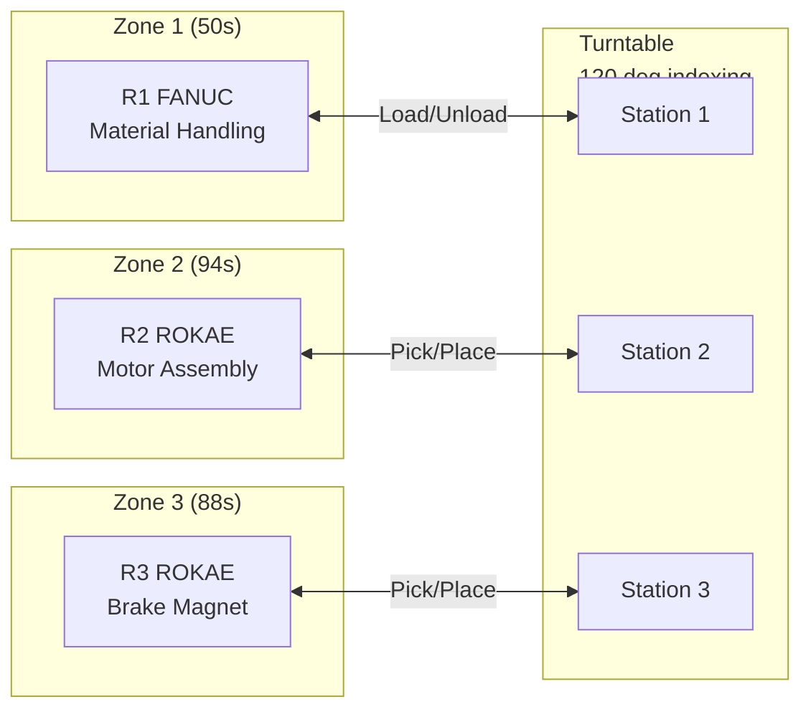
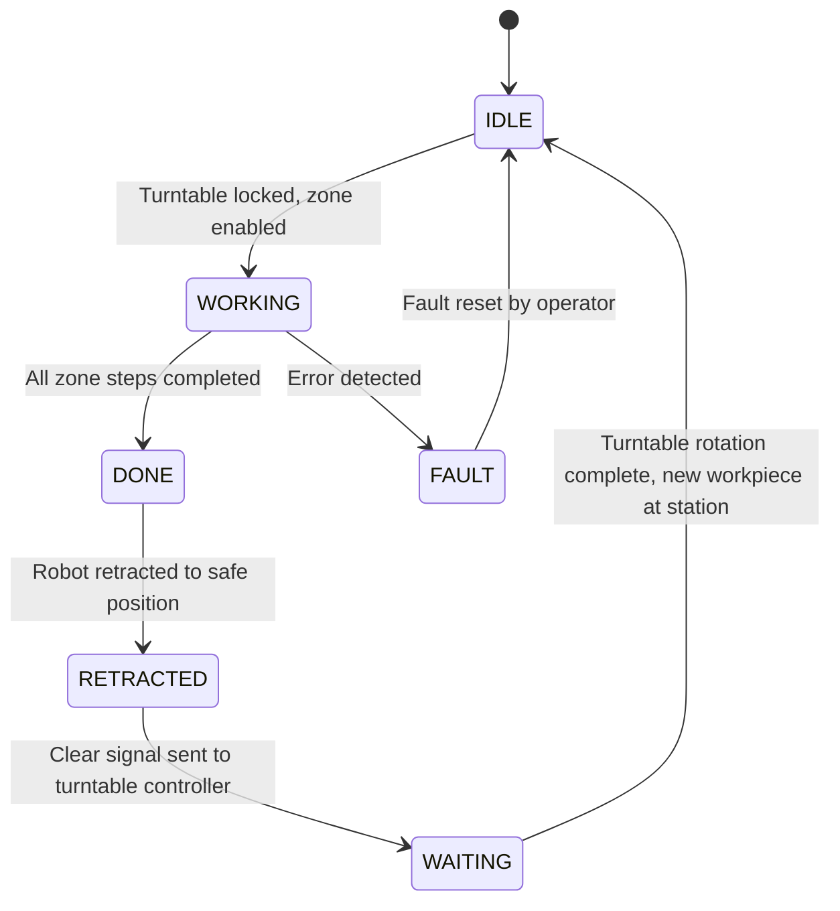

# Robot Coordination

> Multi-Robot Synchronization and Interlock Design for OP08#-1 Workstation

This document describes the coordination strategy for the 3-robot assembly cell, covering zone-based interlock logic, turntable synchronization, collision avoidance, takt time balancing, and product variant switching.

---

## Table of Contents

- [Coordination Overview](#coordination-overview)
- [Zone-Based Architecture](#zone-based-architecture)
- [Interlock Logic](#interlock-logic)
- [Turntable Synchronization](#turntable-synchronization)
- [Collision Avoidance](#collision-avoidance)
- [Takt Time Analysis](#takt-time-analysis)
- [Product Variant Switching](#product-variant-switching)
- [Communication Interface](#communication-interface)

---

## Coordination Overview

The OP08#-1 workstation coordinates 3 robots around a shared 120-degree indexed turntable. Each robot operates in a dedicated zone, and the turntable acts as the synchronization mechanism between zones.



### Key Principles

1. **Zone isolation**: Each robot operates exclusively within its assigned zone during the assembly phase
2. **Turntable as barrier**: The turntable only rotates when all robots are retracted to safe positions
3. **Bottleneck-driven takt**: The slowest zone (Zone 2, 94s) determines the system takt time
4. **Pipeline parallelism**: All 3 zones operate concurrently on different workpieces

---

## Zone-Based Architecture

### Zone Definitions

| Zone | Robot | Turntable Station | Workspace | Function |
|:-----|:------|:------------------|:----------|:---------|
| **Zone 1** | R1 (FANUC) | Station 1 | Tray stackers, conveyor, turntable station 1 | Material loading and finished product unloading |
| **Zone 2** | R2 (ROKAE) | Station 2 | Turntable station 2, worktable, screw feeder 1 | Motor + mount body assembly, 4x screw tightening |
| **Zone 3** | R3 (ROKAE) | Station 3 | Turntable station 3, worktable, screw feeder 2 | Brake magnet base assembly, 2x screw tightening |

### Zone State Machine

Each zone follows an independent state machine:



### Zone State Signals

| Signal | Direction | Type | Description |
|:-------|:----------|:-----|:------------|
| `Zone_N_Enable` | PLC -> Robot | Bool | Permission to start zone operations |
| `Zone_N_Busy` | Robot -> PLC | Bool | Robot is actively working in zone |
| `Zone_N_Done` | Robot -> PLC | Bool | All zone steps completed successfully |
| `Zone_N_Clear` | Robot -> PLC | Bool | Robot retracted to safe position (outside turntable envelope) |
| `Zone_N_Fault` | Robot -> PLC | Bool | Error condition in zone |
| `Zone_N_FaultCode` | Robot -> PLC | UInt16 | Specific error code |

---

## Interlock Logic

### Turntable Rotation Interlock

The turntable may only rotate when ALL of the following conditions are true:

```
TurntableRotatePermit := 
    Zone1_Clear AND Zone2_Clear AND Zone3_Clear
    AND NOT Zone1_Fault AND NOT Zone2_Fault AND NOT Zone3_Fault
    AND TurntableLock_Disengaged
    AND SafetyGate_Closed
    AND EStop_NotActive
    AND AllRobots_InSafePosition;
```

### Robot Enable Interlock

Each robot may only begin work when:

```
Zone_N_Enable :=
    TurntableRotation_Complete
    AND TurntableLock_Engaged
    AND TurntableLockSensor_Confirmed
    AND NOT TurntableServo_Enabled
    AND SafetyGate_Closed
    AND EStop_NotActive;
```

### Cross-Zone Interlocks

| Interlock | Condition | Action |
|:----------|:----------|:-------|
| **R2 -> Turntable** | R2 arm within turntable zone | Block turntable rotation |
| **R3 -> Turntable** | R3 arm within turntable zone | Block turntable rotation |
| **R1 -> Turntable** | R1 arm within turntable zone | Block turntable rotation |
| **Turntable -> All robots** | Turntable rotating | Disable all robot motion |
| **R2 -> R3 worktable** | R2 at worktable (step 17) | Block R3 worktable access |
| **Clamp -> Robot** | Clamp engaged | Block robot approach to clamped zone |

### Signal Handshake Sequence

```
1. Zone 2 (R2) completes step 11 (release clamp)     -> Zone2_Done = TRUE
2. Zone 3 (R3) completes step 16 (release clamp)     -> Zone3_Done = TRUE
3. Zone 1 (R1) completes step 4 (load materials)     -> Zone1_Done = TRUE
4. R2 picks finished assembly (step 17)              -> Zone3_Done remains TRUE
5. R2 places on turntable, retracts                   -> Zone2_Clear = TRUE
6. R3 retracts                                        -> Zone3_Clear = TRUE
7. R1 retracts                                        -> Zone1_Clear = TRUE
8. PLC verifies all Clear signals                     -> TurntableRotatePermit = TRUE
9. PLC commands turntable rotation (120 deg)
10. Turntable reaches position, lock engages
11. PLC sets Zone_N_Enable for all zones              -> New cycle begins
```

---

## Turntable Synchronization

### Synchronization Mechanism

The turntable operates as a synchronization barrier in a classic producer-consumer pattern:

- **Producers**: R1 (loads materials at station 1), R2 (returns finished assembly at station 3)
- **Consumer**: All robots consume workpieces from their respective stations after rotation
- **Barrier**: Turntable rotation is the synchronization point -- no robot can proceed until all are done and the turntable has rotated

### Timing Diagram

```
Time(s)  0        50       88       94       98
         |--------|--------|--------|--------|
Zone 1:  [==R1 working==][--idle--waiting--]
Zone 2:  [==========R2 working (bottleneck)==========]
Zone 3:  [========R3 working========][idle]
                                              [TT rotate]
         ^                                    ^         ^
         Zones enabled                        All clear  New cycle
```

### Wait Logic

When a zone finishes before the bottleneck zone:

- **Zone 1 (R1)**: Finishes at 50s, waits ~44s for Zone 2 to complete. R1 holds position or returns to home.
- **Zone 3 (R3)**: Finishes at 88s, waits ~6s for Zone 2. R3 retracts to safe position.
- **Zone 2 (R2)**: Bottleneck at 94s. No waiting, immediately signals done.

### Turntable Motion Profile

| Parameter | Value |
|:----------|:------|
| **Index angle** | 120.000 degrees |
| **Position tolerance** | +/- 0.020 degrees |
| **Maximum velocity** | 60 deg/s |
| **Acceleration** | 120 deg/s^2 |
| **Deceleration** | 120 deg/s^2 |
| **Motion profile** | Trapezoidal velocity |
| **Rotation duration** | ~2.0 seconds |
| **Settling time** | ~0.3 seconds |
| **Mechanical lock** | Pneumatic pin, sensor-confirmed |

---

## Collision Avoidance

### Workspace Analysis

The three robots have physically separated primary workspaces, but potential overlap exists in two areas:

1. **Turntable perimeter**: All 3 robots reach into the turntable zone for pick/place operations
2. **Worktable area**: R2 and R3 share the worktable (R2 for steps 5-11, R3 for steps 12-16, R2 again for step 17)

### Prevention Strategy

| Strategy | Implementation | Coverage |
|:---------|:--------------|:---------|
| **Zone isolation** | Robots only enter turntable zone when turntable is locked and their zone is enabled | Turntable perimeter |
| **Sequential handoff** | R2 exits worktable before R3 enters; R3 exits before R2 returns for step 17 | Worktable area |
| **Software limits** | Robot joint/Cartesian space limits configured to prevent reaching into adjacent zones | All zones |
| **Proximity monitoring** | Proximity sensors at zone boundaries detect unexpected robot presence | Critical boundaries |
| **Safety zones** | ISO 10218 safety-rated monitored stop if robot approaches zone boundary | All zones |

### Worktable Handoff Protocol

The worktable is shared between Zone 2 (R2) and Zone 3 (R3) within a single cycle:

```
R2 steps 5-11: R2 owns worktable
    R2 places motor, aligns mount body, tightens screws
    R2 releases clamp (step 11)
    R2 retracts from worktable
    R2 signals: Worktable_Free = TRUE

--- Turntable rotates (R2 and R3 both retracted) ---

R3 steps 12-16: R3 owns worktable (only for #11&#18)
    R3 waits for Worktable_Free from turntable cycle
    R3 places brake magnet base, tightens screws
    R3 releases clamp (step 16)
    R3 retracts from worktable
    R3 signals: Zone3_BrakeComplete = TRUE

R2 step 17: R2 briefly re-enters worktable
    R2 waits for Zone3_BrakeComplete
    R2 picks finished assembly from worktable
    R2 places on turntable station 3
    R2 retracts
```

### Emergency Collision Response

If any proximity sensor detects an unexpected robot presence:

1. **Immediate**: Safety-rated monitored stop (SOS) for all robots in the affected zone
2. **Within 100ms**: All robot servo drives receive STO (Safe Torque Off) via FSoE
3. **Operator action**: Manual reset required after root cause investigation
4. **Logging**: Event recorded with timestamp, robot positions, and sensor states

---

## Takt Time Analysis

### Per-Zone Breakdown

#### Zone 1 -- R1 Material Handling (50 seconds)

| Step | Description | Time (s) |
|:-----|:------------|:---------|
| 1 | Pick finished product -> conveyor | 8 |
| 2 | Vision pick motor mount body -> station 1 | 14 |
| 3 | Vision pick motor -> station 1 transit | 14 |
| 4 | Vision pick brake magnet base (if #11&#18) | 14 |
| | **Total (Actuator #11&#18)** | **50** |
| | **Total (Actuator #8, skip step 4)** | **36** |

#### Zone 2 -- R2 Motor Assembly (94 seconds)

| Step | Description | Time (s) |
|:-----|:------------|:---------|
| 5 | Pick motor -> worktable | 10 |
| 6 | Wire harness dressing | 8 |
| 7 | Pick mount body -> align over motor | 12 |
| 8 | Clamp press | 4 |
| 9 | Pick 4x screws from feeder | 16 |
| 10 | Auto-tighten 4 screws | 36 |
| 11 | Release clamp | 4 |
| 17 | Return assembly to turntable | 4 |
| | **Total** | **94** |

#### Zone 3 -- R3 Brake Magnet Assembly (88 seconds)

| Step | Description | Time (s) |
|:-----|:------------|:---------|
| 12 | Pick brake magnet base -> worktable | 12 |
| 13 | Clamp press | 4 |
| 14 | Pick 2x screws from feeder | 10 |
| 15 | Auto-tighten 2 screws | 20 |
| 16 | Release clamp | 4 |
| | **Total (Actuator #11&#18)** | **50** |
| | **Total (Actuator #8, all skipped)** | **0** |
| | **Zone 3 total with step 17 wait** | **88** |

### Overall Equipment Effectiveness (OEE) Targets

| Factor | Target | Notes |
|:-------|:-------|:------|
| **Availability** | > 95% | Planned maintenance 1 hour/shift |
| **Performance** | > 98% | Minimal speed losses (screw retry < 2%) |
| **Quality** | > 99.5% | Torque verification on every screw |
| **OEE** | > 93% | Product of A x P x Q |

---

## Product Variant Switching

### Variant Differences

| Feature | Actuator #8 | Actuator #11&#18 |
|:--------|:------------|:-----------------|
| **Motor size** | 40mm (D47 x H17) | 60mm (D68 x H20.8) |
| **Mount body size** | L120 x W86.8 x H33.75 | L155 x W80 x H53.6 |
| **Motor screws** | M2.5x4 x4 | M2.5x4 x4 |
| **Brake magnet** | None | Yes, M2.5x6 x2 |
| **R3 active** | No (standby) | Yes |
| **Takt time** | 94s (R2 bottleneck) | 94s (R2 bottleneck) |
| **Zone 3 time** | ~10s (step 17 only) | 88s |

### Recipe System

Product variants are managed through the PLC recipe system:

```
RECIPE: Actuator_8
    Motor_Type := MOTOR_40MM
    Mount_Body_Type := MOUNT_120
    Screw1_Spec := M2_5_x_4
    Screw1_Count := 4
    Screw1_Torque := 0.8..1.2 Nm
    BrakeMagnet_Enable := FALSE
    R3_Enable := FALSE
    Zone3_Skip := TRUE
    Vision_Template := "act8_templates"

RECIPE: Actuator_11_18
    Motor_Type := MOTOR_60MM
    Mount_Body_Type := MOUNT_155
    Screw1_Spec := M2_5_x_4
    Screw1_Count := 4
    Screw1_Torque := 0.8..1.2 Nm
    Screw2_Spec := M2_5_x_6
    Screw2_Count := 2
    Screw2_Torque := 1.0..1.5 Nm
    BrakeMagnet_Enable := TRUE
    R3_Enable := TRUE
    Zone3_Skip := FALSE
    Vision_Template := "act11_18_templates"
```

### Changeover Procedure

1. Operator selects new variant on HMI
2. PLC loads recipe parameters (automatic, ~2 seconds)
3. Vision templates switch automatically
4. R3 enable/disable flag updated
5. If fixture change required: operator opens safety gate, swaps turntable sub-plates
6. Safety gate closed, system re-armed
7. First cycle runs with operator verification

---

## Communication Interface

### EtherCAT PDO Interface (Robot <-> PLC)

**PLC to Robot (RxPDO):**

| Byte Offset | Data Type | Signal | Description |
|:------------|:----------|:-------|:------------|
| 0 | UINT16 | ControlWord | Enable, halt, fault reset, zone enable |
| 2 | UINT16 | CommandCode | Specific operation command (pick, place, tighten) |
| 4 | INT32 | TargetX | Target X position (0.01 mm units) |
| 8 | INT32 | TargetY | Target Y position (0.01 mm units) |
| 12 | INT32 | TargetZ | Target Z position (0.01 mm units) |
| 16 | INT32 | TargetRz | Target rotation (0.001 deg units) |
| 20 | UINT16 | VisionOffsetX | Vision correction X (0.01 mm units) |
| 22 | UINT16 | VisionOffsetY | Vision correction Y (0.01 mm units) |
| 24 | UINT16 | VisionOffsetRz | Vision correction Rz (0.001 deg units) |

**Robot to PLC (TxPDO):**

| Byte Offset | Data Type | Signal | Description |
|:------------|:----------|:-------|:------------|
| 0 | UINT16 | StatusWord | Ready, enabled, fault, in position, zone clear |
| 2 | UINT16 | CurrentStep | Current step number (1-17) |
| 4 | INT32 | ActualX | Actual X position |
| 8 | INT32 | ActualY | Actual Y position |
| 12 | INT32 | ActualZ | Actual Z position |
| 16 | INT32 | ActualRz | Actual rotation |
| 20 | UINT16 | FaultCode | Active fault code (0 = no fault) |
| 22 | UINT16 | ScrewTorque | Last screw torque (0.01 Nm units) |
| 24 | UINT16 | ScrewAngle | Last screw angle (0.1 deg units) |
