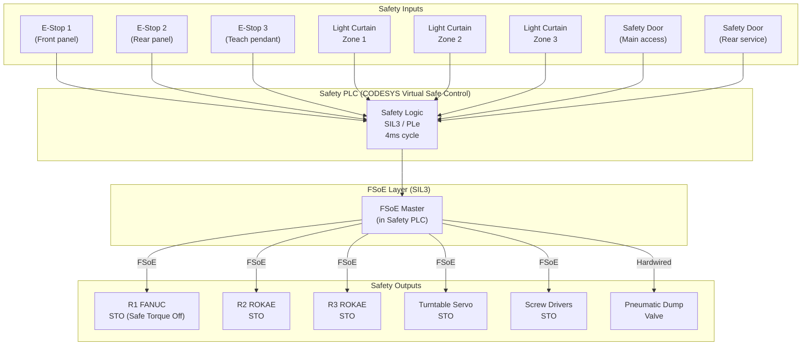

# Safety Design

> Functional Safety Architecture for the OP08#-1 Multi-Robot Assembly Cell

This document describes the safety architecture of the OP08#-1 workstation, covering the applicable standards, safety functions, FSoE implementation, E-Stop design, safeguarding devices, and robot safety zones.

---

## Table of Contents

- [Applicable Standards](#applicable-standards)
- [Safety Architecture Overview](#safety-architecture-overview)
- [Safety Functions](#safety-functions)
- [FSoE Over EtherCAT](#fsoe-over-ethercat)
- [Emergency Stop Design](#emergency-stop-design)
- [Safeguarding Devices](#safeguarding-devices)
- [Robot Safety Zones](#robot-safety-zones)
- [Safety PLC Logic](#safety-plc-logic)
- [Validation and Testing](#validation-and-testing)

---

## Applicable Standards

| Standard | Edition | Application |
|:---------|:--------|:------------|
| **ISO 13849-1** | Ed. 3 (2015) | Safety of machinery -- Safety-related parts of control systems. Target: **PLd, Category 3** |
| **ISO 13849-2** | Ed. 2 (2012) | Validation of safety functions |
| **ISO 10218-1** | Ed. 2 (2011) | Robot safety -- Robot requirements |
| **ISO 10218-2** | Ed. 2 (2011) | Robot safety -- Robot system integration |
| **ISO 13850** | Ed. 3 (2015) | Emergency stop function -- Design principles |
| **IEC 62443** | Series | Industrial cybersecurity (defense in depth) |
| **IEC 61508** | Ed. 2 (2010) | Functional safety of E/E/PE systems -- **SIL3** for FSoE |
| **IEC 61496-1** | Ed. 3 (2012) | Electro-sensitive protective equipment -- Type 4 light curtains |
| **IEC 60204-1** | Ed. 6 (2016) | Safety of machinery -- Electrical equipment |
| **ETG.5100** | v1.2 | FSoE (Fail Safe over EtherCAT) protocol specification |
| **ISO 14119** | Ed. 1 (2013) | Interlocking devices associated with guards |

---

## Safety Architecture Overview

The workstation implements a **Category 3, PLd** safety architecture per ISO 13849-1. The safety system uses a combination of hardwired safety circuits and FSoE (Fail Safe over EtherCAT) for communication between safety devices and the safety PLC.



### Dual-Channel Architecture (Category 3)

Category 3 requires fault detection on both channels:

```
Safety Input Device (e.g., E-Stop)
    |
    +-- Channel A --> Safety Input Module (Terminal 1) --> Safety PLC Logic
    |                                                          |
    +-- Channel B --> Safety Input Module (Terminal 2) --> Safety PLC Logic
                                                               |
                                                    Cross-comparison
                                                               |
                                                    Safety Output
```

Both channels must agree for the safety function to be in the "safe" state. A single fault in either channel is detected by the cross-comparison, and the system transitions to the safe state.

---

## Safety Functions

### Safety Function List

| ID | Safety Function | Input Device | Output Action | Category | PL | Response Time |
|:---|:---------------|:-------------|:-------------|:---------|:---|:-------------|
| SF-01 | Emergency Stop | E-Stop buttons (x3) | STO all drives, pneumatic dump | Cat. 3 | PLd | < 50 ms |
| SF-02 | Zone 1 Access Protection | Light curtain (Type 4) | R1 STO | Cat. 3 | PLd | < 100 ms |
| SF-03 | Zone 2 Access Protection | Light curtain (Type 4) | R2 STO, screw driver STO | Cat. 3 | PLd | < 100 ms |
| SF-04 | Zone 3 Access Protection | Light curtain (Type 4) | R3 STO, screw driver STO | Cat. 3 | PLd | < 100 ms |
| SF-05 | Main Door Guard | Safety door switch (ISO 14119) | All robot STO, turntable STO | Cat. 3 | PLd | < 200 ms |
| SF-06 | Rear Door Guard | Safety door switch (ISO 14119) | All robot STO, turntable STO | Cat. 3 | PLd | < 200 ms |
| SF-07 | R1 Speed Monitoring | Robot encoder (dual-channel) | R1 STO if exceeded | Cat. 3 | PLd | < 20 ms |
| SF-08 | R2 Speed Monitoring | Robot encoder (dual-channel) | R2 STO if exceeded | Cat. 3 | PLd | < 20 ms |
| SF-09 | R3 Speed Monitoring | Robot encoder (dual-channel) | R3 STO if exceeded | Cat. 3 | PLd | < 20 ms |
| SF-10 | R1 Position Monitoring | Robot encoder (dual-channel) | R1 SOS / STO | Cat. 3 | PLe | < 20 ms |
| SF-11 | R2 Position Monitoring | Robot encoder (dual-channel) | R2 SOS / STO | Cat. 3 | PLe | < 20 ms |
| SF-12 | R3 Position Monitoring | Robot encoder (dual-channel) | R3 SOS / STO | Cat. 3 | PLe | < 20 ms |
| SF-13 | Turntable Lock Check | Lock pin sensor (dual) | Block rotation if unlocked | Cat. 3 | PLd | < 50 ms |
| SF-14 | Clamp Force Monitor | Pressure switch (dual) | Block robot entry if clamped | Cat. 2 | PLc | < 100 ms |

### Safe Torque Off (STO) -- IEC 61800-5-2

STO removes the drive torque-producing energy from the motor. All servo drives (robot axes, turntable, screw drivers) support STO as a safety function:

- **Function**: Prevents unexpected startup by de-energizing the motor winding
- **Implementation**: Dual-channel STO inputs on each servo drive, activated via FSoE
- **Response time**: < 10 ms from STO command to zero torque
- **Restart**: Requires deliberate operator action (reset button + enable sequence)

### Safety-Rated Monitored Stop (SOS)

SOS monitors that the robot remains at standstill within a defined position window:

- **Position window**: +/- 0.5 degrees per joint axis
- **Monitoring**: Continuous, FSoE cycle (4 ms)
- **Violation response**: Immediate STO if position drifts outside window

---

## FSoE Over EtherCAT

Fail Safe over EtherCAT (FSoE) implements safety communication as a "black channel" over the standard EtherCAT network. This means FSoE does not rely on the underlying transport for safety -- it adds its own safety protocol layer.

### FSoE Protocol Features

| Feature | Description |
|:--------|:------------|
| **Safety integrity** | SIL3 per IEC 61508, PLe per ISO 13849-1 |
| **Black channel** | Safety is independent of the transport medium |
| **CRC-16** | 16-bit CRC on every safety message (Hamming distance 4) |
| **Watchdog** | Configurable watchdog timer (typical: 100 ms) |
| **Sequence counter** | Detects message repetition, loss, insertion, resequencing |
| **Connection ID** | Unique identifier prevents cross-talk between FSoE connections |
| **Data integrity** | Detects corruption, delay, repetition, loss, insertion, resequencing, masquerade |

### FSoE Connection Map

| Connection | Master | Slave | Safety Data | Watchdog |
|:-----------|:-------|:------|:------------|:---------|
| FSoE-01 | Safety PLC | R1 FANUC (STO) | 1 byte (STO command / status) | 100 ms |
| FSoE-02 | Safety PLC | R2 ROKAE (STO) | 1 byte | 100 ms |
| FSoE-03 | Safety PLC | R3 ROKAE (STO) | 1 byte | 100 ms |
| FSoE-04 | Safety PLC | Turntable (STO) | 1 byte | 100 ms |
| FSoE-05 | Safety PLC | Screw Driver 1 (STO) | 1 byte | 100 ms |
| FSoE-06 | Safety PLC | Screw Driver 2 (STO) | 1 byte | 100 ms |
| FSoE-07 | Safety PLC | Safety I/O (EL6900) | 4 bytes (E-Stops, light curtains, doors) | 50 ms |

### CODESYS Virtual Safe Control (2026)

Starting in 2026, CODESYS Virtual Safe Control provides a software-based safety PLC:

- Runs in the same container as Virtual Control SL
- **1oo2d (one-out-of-two with diagnostics)** architecture on multi-core IPC
- Safety application programmed in Safety FBD (IEC 61131-3)
- Certified safety compiler generates verified machine code
- Eliminates the need for a separate hardware safety PLC
- Safety functions validated with the CODESYS Safety Test Suite

---

## Emergency Stop Design

### E-Stop Circuit (ISO 13850)

The workstation has three E-Stop buttons:

| Location | Type | Color | ISO 13850 Class |
|:---------|:-----|:------|:----------------|
| Front operator panel | Palm-actuated mushroom head, twist-to-release | Red/Yellow | Category 0 (immediate power cut) |
| Rear service panel | Palm-actuated mushroom head, twist-to-release | Red/Yellow | Category 0 |
| Teach pendant (if applicable) | Enabling switch with E-Stop | Red/Yellow | Category 0 |

### E-Stop Response Sequence

1. **t = 0 ms**: E-Stop button pressed, contact opens
2. **t < 4 ms**: Safety PLC detects input change (4 ms safety cycle)
3. **t < 10 ms**: FSoE STO commands sent to all servo drives
4. **t < 20 ms**: All servo drives in STO state, motors de-energized
5. **t < 50 ms**: Pneumatic dump valve activated, all cylinders vent to atmosphere
6. **t < 100 ms**: System fully in safe state (all motion stopped, pressure released)

### E-Stop Reset Procedure

1. Operator identifies and resolves the cause of the E-Stop
2. E-Stop button twist-released (all buttons must be released)
3. Operator presses illuminated reset button on control panel
4. Safety PLC performs self-test (dual-channel cross-check)
5. System enters "ready" state (robots not yet enabled)
6. Operator presses cycle start to resume production

---

## Safeguarding Devices

### Light Curtains

Three Type 4 (IEC 61496-1) light curtains protect the three robot work zones:

| Light Curtain | Zone | Height | Resolution | Response Time | Detection |
|:-------------|:-----|:-------|:-----------|:-------------|:----------|
| LC-1 | Zone 1 (R1) | 1200 mm | 14 mm (finger detection) | < 15 ms | Body/hand intrusion |
| LC-2 | Zone 2 (R2) | 1200 mm | 14 mm | < 15 ms | Body/hand intrusion |
| LC-3 | Zone 3 (R3) | 1200 mm | 14 mm | < 15 ms | Body/hand intrusion |

**Muting**: Light curtains are muted during conveyor material transfer (Zone 1) with time-limited muting (max 10 seconds) and muting indicator lamp.

### Safety Door Switches

| Door | Type | Standard | Features |
|:-----|:-----|:---------|:---------|
| Main access door | Coded magnetic switch (ISO 14119) | Type 4, high coding | Dual-channel, tamper-resistant, holding force 2500 N |
| Rear service door | Coded magnetic switch (ISO 14119) | Type 4, high coding | Dual-channel, tamper-resistant |

**Door interlock**: Opening any safety door triggers Category 0 stop (STO) for all robots and turntable. The door cannot be opened while the turntable is rotating (electromagnetic lock, controlled release only when all motion stopped).

### Safety Perimeter

The workstation is enclosed by safety fencing (ISO 14120) on all sides except where light curtains provide access protection:

- **Fence height**: 2000 mm minimum
- **Mesh size**: 25 x 25 mm maximum (prevents reach-through)
- **Bottom gap**: < 180 mm (ISO 13857, Table 4)
- **Safety distance**: Calculated per ISO 13855 based on approach speed and response time

---

## Robot Safety Zones

### ISO 10218 Zone Definitions

Each robot has defined safety zones monitored by the safety system:

```
+--------------------------------------------------+
|                                                    |
|    +------------+                                  |
|    |  Zone 1    |    Shared        +------------+  |
|    |  R1 FANUC  |    Turntable     |  Zone 2    |  |
|    |            |    Area          |  R2 ROKAE  |  |
|    +-----+------+                  +------+-----+  |
|          |        +-----------+           |        |
|          +------->| Turntable |<----------+        |
|          |        | (120 deg) |           |        |
|          |        +-----------+           |        |
|    +-----+------+       ^          +------+-----+  |
|    |  Tray      |       |          |  Worktable |  |
|    |  Stackers  |       |          |  (shared)  |  |
|    +------------+  +----+-----+    +------+-----+  |
|                    |  Zone 3   |          |        |
|                    |  R3 ROKAE |<---------+        |
|                    |           |                    |
|                    +-----------+                    |
|                                                    |
+--------------------------------------------------+
```

### Zone Monitoring Parameters

| Robot | Maximum Speed (Auto) | Maximum Speed (Manual/T1) | Position Envelope | SOS Window |
|:------|:--------------------|:------------------------|:-----------------|:-----------|
| **R1 FANUC** | 2000 mm/s | 250 mm/s | Zone 1 boundary + turntable | +/- 0.5 deg/joint |
| **R2 ROKAE** | 1500 mm/s | 250 mm/s | Zone 2 boundary + turntable + worktable | +/- 0.5 deg/joint |
| **R3 ROKAE** | 1500 mm/s | 250 mm/s | Zone 3 boundary + worktable | +/- 0.5 deg/joint |

### Collaborative Workspace Monitoring

Although this workstation is not designed for human-robot collaboration during normal operation, the following safety measures protect operators during setup, maintenance, and troubleshooting:

- **T1 (reduced speed) mode**: 250 mm/s maximum, enabling switch required, single-step operation
- **T2 (test speed) mode**: Full speed with enabling switch, restricted to trained personnel
- **Auto mode**: Safety guards must be closed, all interlocks active
- **Safe speed monitoring**: Per-axis velocity checked against safety-rated limits every 4 ms
- **Safe position monitoring**: Cartesian space boundary check using safety-rated forward kinematics

### Mode Selection

Mode is selected via a key switch (ISO 10218-1, 5.7):

| Mode | Key Position | Speed | Guards | Enabling Switch |
|:-----|:-------------|:------|:-------|:---------------|
| **AUTO** | 1 | Full | All closed, interlocked | Not required |
| **T1** | 2 | 250 mm/s max | May be open | Required (3-position) |
| **T2** | 3 | Full | May be open | Required (3-position) |

The 3-position enabling switch allows operation in the intermediate position only. Releasing (panic release) or squeezing (panic clench) both trigger immediate stop.

---

## Safety PLC Logic

### Main Safety Program Structure

```
PROGRAM SafetyMain
    // Inputs (read every 4ms safety cycle)
    EStop_Ch1, EStop_Ch2 : SAFEBOOL;
    LC1_OSSD1, LC1_OSSD2 : SAFEBOOL;
    LC2_OSSD1, LC2_OSSD2 : SAFEBOOL;
    LC3_OSSD1, LC3_OSSD2 : SAFEBOOL;
    Door1_Ch1, Door1_Ch2 : SAFEBOOL;
    Door2_Ch1, Door2_Ch2 : SAFEBOOL;
    ModeSwitch : SAFEINT;
    
    // Outputs
    R1_STO : SAFEBOOL;
    R2_STO : SAFEBOOL;
    R3_STO : SAFEBOOL;
    TT_STO : SAFEBOOL;
    SD1_STO : SAFEBOOL;
    SD2_STO : SAFEBOOL;
    PneumaticDump : SAFEBOOL;
END_PROGRAM

// E-Stop logic (Category 0)
IF NOT EStop_Ch1 OR NOT EStop_Ch2 THEN
    R1_STO := TRUE;
    R2_STO := TRUE;
    R3_STO := TRUE;
    TT_STO := TRUE;
    SD1_STO := TRUE;
    SD2_STO := TRUE;
    PneumaticDump := TRUE;
END_IF

// Zone 1 light curtain (only R1)
IF ModeSwitch = AUTO AND (NOT LC1_OSSD1 OR NOT LC1_OSSD2) THEN
    R1_STO := TRUE;
END_IF

// Zone 2 light curtain (R2 + screw driver 1)
IF ModeSwitch = AUTO AND (NOT LC2_OSSD1 OR NOT LC2_OSSD2) THEN
    R2_STO := TRUE;
    SD1_STO := TRUE;
END_IF

// Zone 3 light curtain (R3 + screw driver 2)
IF ModeSwitch = AUTO AND (NOT LC3_OSSD1 OR NOT LC3_OSSD2) THEN
    R3_STO := TRUE;
    SD2_STO := TRUE;
END_IF

// Safety doors (all robots + turntable)
IF NOT Door1_Ch1 OR NOT Door1_Ch2 OR NOT Door2_Ch1 OR NOT Door2_Ch2 THEN
    R1_STO := TRUE;
    R2_STO := TRUE;
    R3_STO := TRUE;
    TT_STO := TRUE;
END_IF
```

### Diagnostics and Monitoring

| Diagnostic | Check | Frequency | Action on Failure |
|:-----------|:------|:----------|:-----------------|
| **Cross-channel discrepancy** | Ch1 != Ch2 for > 100 ms | Every safety cycle (4 ms) | Fault state, STO all |
| **FSoE watchdog** | No response within timeout | Per FSoE connection | STO for affected slave |
| **Safety I/O test pulse** | Output test pulse verified | Every 10 minutes | Fault state if mismatch |
| **Light curtain contamination** | Sender/receiver signal strength | Continuous | Warning, then lockout |
| **E-Stop wiring** | Continuity check via test pulse | At startup + periodically | Prevent startup |

---

## Validation and Testing

### ISO 13849-2 Validation Requirements

| Test | Method | Acceptance Criteria |
|:-----|:-------|:-------------------|
| **E-Stop response time** | Oscilloscope measurement from button press to STO | < 50 ms |
| **Light curtain response** | Object insertion test with timing | < 100 ms |
| **Safety door interlock** | Open door, verify robot stop | < 200 ms |
| **Cross-channel fault injection** | Disconnect one channel, verify detection | System enters fault state |
| **FSoE watchdog test** | Disconnect FSoE slave cable | STO within watchdog timeout |
| **Speed monitoring** | Jog robot at increasing speed, verify limit | STO at limit + tolerance |
| **Position monitoring** | Push robot in SOS mode, verify detection | STO within position window |
| **Mode switch** | Change mode during operation | Correct behavior per mode |
| **Power cycle** | Remove and restore power | System does not auto-restart |
| **Common cause failure** | Review and document CCF measures | Score >= 65 (ISO 13849-1 Annex F) |

### Performance Level Calculation (ISO 13849-1)

For the primary safety function (E-Stop, SF-01):

| Parameter | Value | Source |
|:----------|:------|:-------|
| **Category** | 3 | Dual-channel with cross-monitoring |
| **MTTFd (per channel)** | 100 years (high) | Safety relay: 20 years, E-Stop contacts: 100 years |
| **DCavg** | 99% (high) | Cross-monitoring, test pulses, FSoE CRC |
| **CCF score** | >= 65 | Separation, diversity, environmental design |
| **Resulting PL** | PLd | Per ISO 13849-1 Table 5 |

### Periodic Inspection Schedule

| Item | Interval | Inspector |
|:-----|:---------|:----------|
| E-Stop function test | Daily (shift start) | Operator |
| Light curtain alignment | Monthly | Maintenance |
| Safety door switch function | Monthly | Maintenance |
| Full safety system validation | Annually | Safety engineer |
| FSoE communication diagnostics | Quarterly | Controls engineer |
| Safety PLC firmware update | As released | Controls engineer (with re-validation) |
