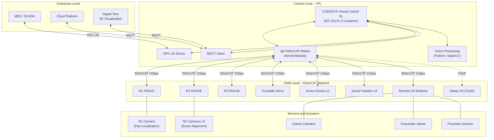

# System Architecture

> OP08#-1 Multi-Robot Assembly Cell -- CODESYS Virtual Control SL + IgH EtherCAT Master

This document describes the complete control system architecture for the OP08#-1 harmonic reducer actuator motor assembly workstation, covering the industrial PC platform, soft PLC runtime, real-time fieldbus, safety layer, vision integration, and network topology.

---

## Table of Contents

- [Architecture Overview](#architecture-overview)
- [Industrial PC Platform](#industrial-pc-platform)
- [CODESYS Virtual Control SL](#codesys-virtual-control-sl)
- [IgH EtherCAT Master](#igh-ethercat-master)
- [EtherCAT Network Topology](#ethercat-network-topology)
- [FSoE Safety Layer](#fsoe-safety-layer)
- [Vision System Integration](#vision-system-integration)
- [OPC UA and MQTT Connectivity](#opc-ua-and-mqtt-connectivity)
- [Network Topology](#network-topology)
- [Digital Twin](#digital-twin)

---

## Architecture Overview

The workstation control architecture follows a 3-tier model:

1. **Field Level** -- EtherCAT slaves (robots, servos, remote I/O, screw drivers), sensors, actuators
2. **Control Level** -- CODESYS Virtual Control SL on IPC with IgH EtherCAT Master
3. **Enterprise Level** -- OPC UA for MES/SCADA, MQTT for cloud telemetry and digital twin



---

## Industrial PC Platform

The IPC serves as the unified control platform, replacing the traditional PLC + separate robot controllers + vision PC setup.

### Hardware Specifications

| Component | Specification | Purpose |
|:----------|:-------------|:--------|
| **CPU** | Intel Core i7-12700 / Xeon W-1270P (8C/16T, 4.9 GHz boost) | Real-time PLC tasks + vision processing |
| **RAM** | 32 GB DDR4-3200 ECC | CODESYS runtime + vision frame buffers + digital twin |
| **Storage** | 512 GB NVMe SSD (industrial grade, pSLC) | OS, runtime, recipe data, log storage |
| **Network** | Dual Intel I210/I225 GbE (hardware timestamping) | Port 1: EtherCAT, Port 2: OPC UA / MQTT / management |
| **OS** | Ubuntu 22.04 LTS with PREEMPT_RT kernel 5.15-rt | Deterministic real-time scheduling |
| **GPU** | Integrated Intel UHD 770 (optional NVIDIA T400 for vision) | Digital twin rendering, vision inference |

### Real-Time Kernel Configuration

The PREEMPT_RT patched kernel provides deterministic scheduling for the EtherCAT master:

- **Kernel version**: 5.15.x-rt with PREEMPT_RT patch series
- **CPU isolation**: `isolcpus=2,3` -- cores 2-3 dedicated to EtherCAT master and CODESYS tasks
- **IRQ affinity**: EtherCAT NIC IRQ pinned to isolated core
- **Memory locking**: `mlockall()` for all real-time processes
- **Scheduling**: `SCHED_FIFO` priority 80 for EtherCAT cyclic task
- **Measured jitter**: < 1 microsecond on isolated cores (cyclictest, 24-hour run)

### Kernel Boot Parameters

```
GRUB_CMDLINE_LINUX="isolcpus=2,3 nohz_full=2,3 rcu_nocbs=2,3 intel_pstate=disable nosmt processor.max_cstate=0 idle=poll"
```

---

## CODESYS Virtual Control SL

CODESYS Virtual Control SL is a containerized soft PLC runtime that implements the full IEC 61131-3 standard on commodity x86 hardware.

### Container Runtime

The CODESYS runtime runs as a Docker/Podman container with real-time privileges:

| Parameter | Value | Notes |
|:----------|:------|:------|
| **Container image** | `codesys/virtual-control-sl:4.x` | Official CODESYS image |
| **CPU affinity** | Core 2 (isolated) | `--cpuset-cpus=2` |
| **RT privileges** | `--cap-add=SYS_NICE --cap-add=IPC_LOCK` | Required for RT scheduling |
| **Network** | `--network=host` | Direct access to EtherCAT NIC |
| **Shared memory** | `/dev/shm` mounted | IPC with vision and digital twin |
| **License** | USB dongle or soft license (CodeMeter) | Per-workstation licensing |

### IEC 61131-3 Task Configuration

| Task | Priority | Cycle Time | Purpose |
|:-----|:---------|:-----------|:--------|
| **EtherCAT_Task** | Highest (1) | 1 ms | EtherCAT PDO exchange, servo control loops |
| **Motion_Task** | High (10) | 1 ms | SoftMotion axis interpolation, turntable indexing |
| **Safety_Task** | High (15) | 4 ms | FSoE protocol processing, safety state machine |
| **Main_Task** | Normal (20) | 10 ms | Assembly sequence state machine, robot coordination |
| **HMI_Task** | Low (50) | 100 ms | HMI data exchange, recipe management |
| **Comm_Task** | Low (60) | 500 ms | OPC UA / MQTT publishing |

### SoftMotion CNC/Robotics

CODESYS SoftMotion provides coordinated multi-axis motion control:

- **Turntable axis**: Single-axis positioning with 120-degree indexing profile (trapezoidal velocity)
- **Screw driver axes**: Torque-controlled tightening with angle monitoring
- **Robot interface**: CODESYS does not directly control robot joint axes -- robots operate as intelligent EtherCAT slaves with command/status PDOs
- **Electronic cam**: Turntable position synchronized with zone occupancy logic

### PLC Programming Languages Used

| Language | Application |
|:---------|:------------|
| **Structured Text (ST)** | Assembly state machine, robot command sequencing, torque calculations |
| **Ladder Diagram (LD)** | Safety interlocks, clamp/valve control, sensor polling |
| **Function Block Diagram (FBD)** | Motion control blocks, timer cascades |
| **Sequential Function Chart (SFC)** | 17-step assembly sequence, variant branching |

---

## IgH EtherCAT Master

The IgH EtherCAT Master is a kernel-space implementation providing microsecond-level determinism for the EtherCAT fieldbus.

### Kernel Module Architecture

```
+------------------------------------------+
|         CODESYS Virtual Control SL        |
|   (User-space, IEC 61131-3 runtime)      |
+------------------+-----------------------+
                   | Shared memory / ioctl
+------------------+-----------------------+
|           IgH EtherCAT Master             |
|   (Kernel module: ec_master.ko)           |
|                                           |
|   +-- Domain 0: Robot PDOs              |
|   +-- Domain 1: Servo PDOs              |
|   +-- Domain 2: I/O PDOs               |
|   +-- Domain 3: FSoE Safety PDOs        |
+------------------+-----------------------+
                   | Raw Ethernet (0x88A4)
+------------------+-----------------------+
|        Intel I210 NIC Driver              |
|   (Modified for EtherCAT, no TCP/IP)      |
+------------------------------------------+
```

### Key Configuration Parameters

| Parameter | Value | Description |
|:----------|:------|:------------|
| **Cycle time** | 1 ms | EtherCAT bus cycle period |
| **DC mode** | Distributed Clocks enabled | Sub-microsecond synchronization across all slaves |
| **DC reference** | First slave (R1 FANUC) | Reference clock for DC synchronization |
| **Domains** | 4 (Robot, Servo, I/O, Safety) | PDO data grouped by function |
| **Watchdog** | 100 ms | Slave communication timeout |
| **Redundancy** | Cable redundancy (optional) | Dual-port slaves for ring topology |

### Installation and Build

```bash
# Clone IgH EtherCAT Master
git clone https://gitlab.com/etherlab.org/ethercat.git
cd ethercat

# Configure for PREEMPT_RT kernel
./configure --enable-generic --disable-8139too \
    --with-linux-dir=/usr/src/linux-headers-5.15.x-rt

# Build and install kernel module
make && sudo make install

# Load module with dedicated NIC
sudo modprobe ec_master main_devices="XX:XX:XX:XX:XX:XX"
```

### Performance Metrics

| Metric | Target | Measured |
|:-------|:-------|:---------|
| **Bus cycle** | 1 ms | 1 ms +/- 0.2 us |
| **Jitter** | < 5 us | < 1 us (isolated core) |
| **Frame size** | < 1500 bytes | ~820 bytes (all PDOs) |
| **DC sync error** | < 100 ns | < 50 ns (after convergence) |
| **Slave count** | Up to 65535 | 12 slaves configured |

---

## EtherCAT Network Topology

The EtherCAT network connects all field devices in a logical ring (physical star/line) topology.

### Slave Configuration

| Position | Device | Type | Vendor | RxPDO | TxPDO | DC |
|:---------|:-------|:-----|:-------|:------|:------|:---|
| 0 | R1 FANUC Controller | EtherCAT slave interface | FANUC | Command pos, mode | Actual pos, status | Yes |
| 1 | R2 ROKAE Controller | EtherCAT slave interface | ROKAE | Command pos, mode | Actual pos, status | Yes |
| 2 | R3 ROKAE Controller | EtherCAT slave interface | ROKAE | Command pos, mode | Actual pos, status | Yes |
| 3 | Turntable Servo Drive | CoE (CiA 402) | Vendor-specific | Target pos, velocity | Actual pos, torque | Yes |
| 4 | Screw Driver 1 | CoE (vendor profile) | Atlas Copco | Torque target, angle | Torque actual, status | Yes |
| 5 | Screw Driver 2 | CoE (vendor profile) | Atlas Copco | Torque target, angle | Torque actual, status | Yes |
| 6 | Screw Feeder Controller | Digital I/O | Vendor-specific | Feed command | Feed complete, count | No |
| 7 | Remote I/O Module 1 | EL-series terminals | Beckhoff | 16 DO | 16 DI | No |
| 8 | Remote I/O Module 2 | EL-series terminals | Beckhoff | 16 DO | 16 DI | No |
| 9 | Remote I/O Module 3 | EL-series terminals | Beckhoff | 8 AO | 8 AI | Yes |
| 10 | Safety I/O Module | FSoE terminal | Beckhoff EL6900 | Safety DO | Safety DI | Yes |
| 11 | Bit Changer | Digital I/O | Vendor-specific | Select bit | Bit ready | No |

### PDO Mapping Summary

**Robot Command PDO (RxPDO):**
- Operation mode (uint8): CSP / CSV / CST
- Target position (int32 x 6): Joint angles in 0.001 degree units
- Digital outputs (uint16): Gripper, suction, tool signals
- Control word (uint16): Enable, halt, fault reset

**Robot Status PDO (TxPDO):**
- Status word (uint16): Ready, enabled, fault, target reached
- Actual position (int32 x 6): Joint angles in 0.001 degree units
- Digital inputs (uint16): Gripper feedback, tool sensors
- Error code (uint16): Active fault code

### Network Wiring

```
IPC (Port 1) ---> R1 FANUC ---> R2 ROKAE ---> R3 ROKAE
                                                    |
                 Bit Changer <--- Safety I/O <--- Turntable Servo
                                                    |
                                  Screw Driver 1 ---> Screw Driver 2
                                                    |
                                  Remote I/O 1 ---> Remote I/O 2 ---> Remote I/O 3
                                                    |
                                  Screw Feeder ---> (return to IPC Port 1)
```

---

## FSoE Safety Layer

Fail Safe over EtherCAT (FSoE) provides SIL3-certified functional safety communication over the standard EtherCAT network.

### Safety Architecture (ISO 13849-1 PLd, Category 3)

| Safety Function | Category | PL | Response Time | Implementation |
|:---------------|:---------|:---|:-------------|:---------------|
| **Emergency Stop** | Cat. 3 | PLd | < 50 ms | Hardwired E-Stop chain + FSoE confirmation |
| **Light Curtain Zone 1** | Cat. 3 | PLd | < 100 ms | Type 4 light curtain, R1 STO on breach |
| **Light Curtain Zone 2** | Cat. 3 | PLd | < 100 ms | Type 4 light curtain, R2 STO on breach |
| **Light Curtain Zone 3** | Cat. 3 | PLd | < 100 ms | Type 4 light curtain, R3 STO on breach |
| **Safety Door** | Cat. 3 | PLd | < 200 ms | Interlocked doors, all robots STO on open |
| **Robot Speed Monitoring** | Cat. 3 | PLd | < 20 ms | Per-axis velocity limit via FSoE |
| **Robot Position Monitoring** | Cat. 3 | PLe | < 20 ms | Safety zone boundary check |

### CODESYS Virtual Safe Control (2026)

Starting in 2026, CODESYS Virtual Safe Control extends the Virtual Control SL with certified safety PLC functionality:

- **SIL3 / PLe** certified safety runtime in the same container
- **Safety-qualified compiler**: Generates verified safe code from safety FBD
- **Black channel**: FSoE messages tunneled through standard EtherCAT frames
- **Safe I/O**: Direct integration with Beckhoff EL6900 safety terminals
- **Dual-channel processing**: Software-based 1oo2d architecture on multi-core IPC

---

## Vision System Integration

The workstation employs 2D industrial cameras for part localization and screw hole alignment.

### Camera Deployment

| Camera | Location | Interface | Resolution | Function |
|:-------|:---------|:----------|:-----------|:---------|
| **R1 Camera** | Mounted on R1 end-effector | GigE Vision | 5 MP | Motor mount body localization in trays, motor localization, brake magnet base localization |
| **R2 Camera 1** | Fixed above R2 worktable | GigE Vision | 5 MP | Screw hole position detection on motor mount body |
| **R2 Camera 2** | Mounted on R2 screw driver | GigE Vision | 2 MP | Screw alignment and tightening verification |

### Vision Processing Pipeline

1. **Image acquisition**: GigE Vision hardware-triggered capture synchronized with robot position
2. **Part localization** (R1): Template matching or contour-based detection of parts in structured trays
3. **Coordinate transformation**: Camera-to-robot TCP calibration (hand-eye calibration)
4. **Screw hole detection** (R2): Circular Hough transform or blob detection for M2.5 screw holes
5. **Offset calculation**: Compute robot position correction in X, Y, Rz for accurate placement
6. **Result communication**: Vision results passed to CODESYS via shared memory or TCP socket

### Calibration

- **Hand-eye calibration**: 9-point calibration pattern, least-squares optimization
- **Intrinsic calibration**: Zhang's method with checkerboard pattern
- **Coordinate systems**: Camera frame -> Tool frame -> Robot base frame -> Workstation world frame

---

## OPC UA and MQTT Connectivity

### OPC UA Server

The CODESYS built-in OPC UA server exposes workstation data to MES/SCADA systems:

| Node | Data Type | Access | Description |
|:-----|:----------|:-------|:------------|
| `Assembly/CycleCount` | UInt32 | Read | Total completed assemblies |
| `Assembly/CurrentVariant` | String | Read/Write | "ACT_8" or "ACT_11_18" |
| `Assembly/TaktTime` | Float | Read | Current cycle time in seconds |
| `Assembly/State` | Enum | Read | Idle, Running, Fault, Changeover |
| `Robot/R1/Status` | Struct | Read | Position, state, error code |
| `Robot/R2/Status` | Struct | Read | Position, state, error code |
| `Robot/R3/Status` | Struct | Read | Position, state, error code |
| `Turntable/Position` | Float | Read | Current angular position (degrees) |
| `Screw/LastTorque[]` | Float[] | Read | Last tightening torque values (array) |
| `Safety/EStopActive` | Bool | Read | Emergency stop state |
| `Recipe/Parameters` | Struct | Read/Write | Torque limits, positions, timing |

**Security**: OPC UA Security Mode = SignAndEncrypt, X.509 certificates, user authentication.

### MQTT Telemetry

MQTT publishes real-time telemetry to cloud platform for monitoring and analytics:

| Topic | QoS | Frequency | Payload |
|:------|:----|:----------|:--------|
| `workstation/op08-1/heartbeat` | 0 | 1 Hz | Timestamp, state, uptime |
| `workstation/op08-1/cycle` | 1 | Per cycle | Cycle time, variant, screw torques, result |
| `workstation/op08-1/alarm` | 2 | On event | Alarm code, severity, description |
| `workstation/op08-1/telemetry` | 0 | 10 Hz | Robot positions, servo currents, I/O states |

**Broker**: Mosquitto or EMQX, TLS 1.3, client certificate authentication.

---

## Network Topology

The workstation uses three physically separated network segments:

```
+----------------------------------------------------------+
|                    Industrial PC                          |
|                                                          |
|  NIC 1 (Intel I210)          NIC 2 (Intel I225)          |
|  EtherCAT dedicated          TCP/IP networks             |
+--------+---------------------+---------------------------+
         |                     |
         |              +------+------+
         |              |   Managed   |
         |              |   Switch    |
         |              +--+---+---+--+
         |                 |   |   |
    EtherCAT Ring     VLAN10 VLAN20 VLAN30
    (No switch)        OPC   Vision  Mgmt
                       UA    GigE
```

### VLAN Configuration

| VLAN | ID | Subnet | Purpose | Devices |
|:-----|:---|:-------|:--------|:--------|
| **EtherCAT** | N/A | No IP stack | Real-time fieldbus | All EtherCAT slaves (direct, no switch) |
| **OPC UA** | 10 | 192.168.10.0/24 | MES/SCADA communication | IPC (.1), MES server (.10), HMI panel (.20) |
| **Vision** | 20 | 192.168.20.0/24 | Camera data transfer | IPC (.1), R1 camera (.11), R2 camera 1 (.12), R2 camera 2 (.13) |
| **Management** | 30 | 192.168.30.0/24 | Remote access, MQTT | IPC (.1), gateway (.254), MQTT broker (.10) |

### Firewall Rules

- EtherCAT NIC: No IP stack, kernel bypass (raw Ethernet frames, EtherType 0x88A4)
- VLAN 10 (OPC UA): Allow TCP 4840 (OPC UA), block all other inbound
- VLAN 20 (Vision): Allow UDP 3956 (GVCP), TCP/UDP 49152-65535 (GVSP), block all other
- VLAN 30 (Management): Allow TCP 1883/8883 (MQTT), TCP 22 (SSH), block all other inbound

---

## Digital Twin

Real-time 3D visualization of the workstation synchronized via MQTT telemetry:

### Architecture

- **Rendering engine**: Web-based (Three.js) or desktop (Unity/Unreal)
- **Data source**: MQTT telemetry topic at 10 Hz robot position updates
- **3D models**: CAD-derived meshes (STEP -> glTF conversion) for all workstation components
- **Synchronization**: Robot joint angles mapped to 3D model articulation in real time
- **Latency**: < 100 ms from physical motion to digital twin rendering

### Features

- Live robot joint visualization with trajectory traces
- Turntable rotation animation synchronized with physical indexing
- Screw tightening torque curve overlay
- Alarm visualization with flashing components
- Cycle time Gantt chart overlay
- Historical playback from logged telemetry data

---

## References

| Standard / Technology | Version | Application |
|:---------------------|:--------|:------------|
| IEC 61131-3 | Ed. 3.0 (2013) | PLC programming languages (ST, LD, FBD, SFC) |
| IEC 61784-2 | Ed. 4.0 (2019) | EtherCAT (CPF 12) communication profile |
| IEC 61508 | Ed. 2.0 (2010) | Functional safety -- SIL3 for FSoE |
| ISO 13849-1 | Ed. 3.0 (2015) | Safety of machinery -- PLd, Category 3 |
| ISO 10218-1/2 | Ed. 2.0 (2011) | Robot safety requirements |
| ETG.5100 | v1.2 | FSoE (Fail Safe over EtherCAT) protocol |
| OPC 10000 | v1.05 | OPC UA specification |
| GigE Vision | v2.0 | Camera interface standard |
